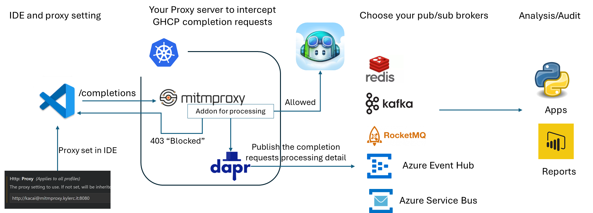
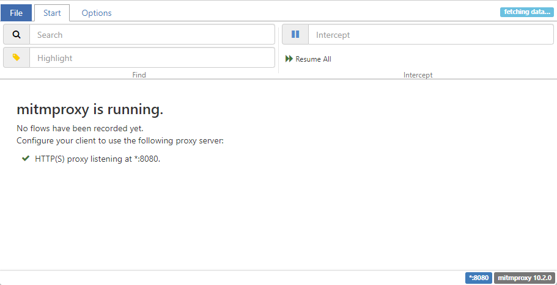
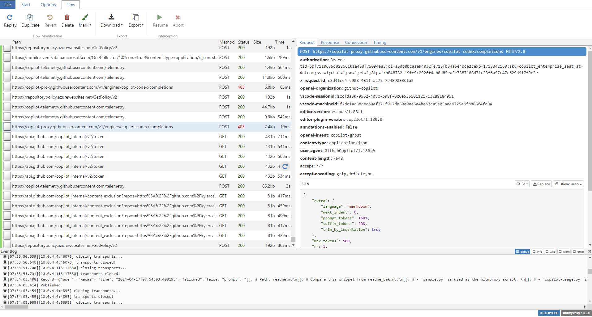

# Local Proxy for GitHub Copilot
A sample to show how to build customized proxy solution on the top of MITMProxy (Man-In-The-Middle) with your addon logic.<br><br>
The typical usage is to mitigate the compliance conerns on that GitHub Copilot may send confidential information to outer of the enterprise. Run the proxy sitting in the middle of your clients and the GitHub Copilot service to intercept requests, checking the prompt against the blocking list, and denies those requests containing improper prompt contents.<br>

## Architecture


## How does it work
- Built on top of MITMProxy and run your logic as Addon to intercept and process the completion requests
- Run as container with Dapr in Kubernetes cluster
- Customers can set the blocking conditions with list of source files and keywords
- If the prompt contains the keywords or contains the contents from source files in the blocking list, the proxy denies the completion request and return 403 code with body “Blocked”


## Description

<!-- files description in table -->
| File | Description |
| --------------- | --------------- |
| packetfilter.py | Addon implementation script. Run with the mitmproxy |
| prompts-pubsub.yml | Dapr component definition, using Redis as the Pub/Sub broker to publish the events |
| cplproxy.yml | Yaml definiton to run this proxy in Kubernetes cluster |
| Dockerfile | Used to build your own container image when you update the addon logic/configuration/certifications |
| blocklist.ini | Define the blocking conditions (now it includes source files and keywords) |
| allowed_users.txt | Define the allowed users to be authenticated on the proxy |
| config.ini | Other configurations need for the addon logic |

## Prerequisites
- Dapr (version 1.13.2 or above) is installed in your Kubernetes cluster
- Redis or other supported brokers with Pub/Sub (https://docs.dapr.io/reference/components-reference/supported-pubsub/)
- Re-build your container image if you update the logic and configuration. In the **Deployment** definition of `cplproxy.yml`, point your container image to the new image

## How to use
1. **Install Dapr in Kubernetes cluster**

```
dapr init -k
```
Check the status and make sure Dapr is up and running:
```
λ dapr status -k
NAME                   NAMESPACE    HEALTHY  STATUS   REPLICAS  VERSION  AGE  CREATED
dapr-placement-server  dapr-system  True     Running  1         1.13.2   1d   2024-04-15 15:27.05
dapr-sidecar-injector  dapr-system  True     Running  1         1.13.2   1d   2024-04-15 15:27.05
dapr-sentry            dapr-system  True     Running  1         1.13.2   1d   2024-04-15 15:27.05
dapr-operator          dapr-system  True     Running  1         1.13.2   1d   2024-04-15 15:27.05
``` 

2. **Install Dapr component for Pub/Sub**

```
λ kubectl apply -f prompts-pubsub.yml
component.dapr.io/promptpubsub configured
```
This tells the Dapr to use your broker to publish the flow processing events.<br><br>
Benefit from Dapr, you can have other choices on the brokers without code changing. You only need to update the component definition file pointing to new brokers.<br><br>
For the up-to-date list of supported Pub/Sub brokers, please visit Dapr links: https://docs.dapr.io/reference/components-reference/supported-pubsub/. <br><br>
In this sample we use Azure Redis.<br>

3. **Start the proxy in Kubernetes cluster**  

```
kubectl apply -f cplproxy.yml
```
This installs the deployments and services to run the proxy in Kubernetes cluster.<br>
After the installation, check the proxy services status:
```
λ kubectl get deployments -l app=cplproxy -o wide
NAME       READY   UP-TO-DATE   AVAILABLE   AGE   CONTAINERS   IMAGES                     SELECTOR
cplproxy   1/1     1            1           16h   cplproxy     kylerdocker/cplproxy:2.1   app=cplproxy

λ kubectl get services cplproxy cplproxyweb -o wide
NAME          TYPE           CLUSTER-IP     EXTERNAL-IP      PORT(S)          AGE   SELECTOR
cplproxy      LoadBalancer   20.0.163.163   143.**.**.184   8080:32651/TCP   16h   app=cplproxy
cplproxyweb   LoadBalancer   20.0.70.142    143.**.**.189   8081:32701/TCP   16h   app=cplproxy

λ kubectl get pods -l app=cplproxy -o wide
NAME                        READY   STATUS    RESTARTS   AGE   IP          NODE                                NOMINATED NODE   READINESS GATES
cplproxy-66f8f985d5-ccvhl   2/2     Running   0          16h   10.0.4.28   aks-agentpool-38020763-vmss000000   <none>           <none>
```

There are two services:
- cplproxy: the proxy service listening on port 8080. Sits in the middle of clients and the GitHub Copilot service to intercept and process the request.
- cplproxyweb: the web console of the cplproxy service listening on port 8081.

Visit the cplproxyweb service and you will see the web console of the cplproxy like below:<br>

<br>

One thing to clarify, in the deployment definition you may notice that we set the container replica as 1, but you should see 2 containers when you run `kubectl get pods` like below:
```
λ kubectl get pods -l app=cplproxy -o wide
NAME                        READY   STATUS    RESTARTS   AGE   IP          NODE                                NOMINATED NODE   READINESS GATES
cplproxy-66f8f985d5-ccvhl   2/2     Running   0          16h   10.0.4.28   aks-agentpool-38020763-vmss000000   <none>           <none>
```
This is expected because Dapr automatically injects a side-car containers into the pod of the cplproxy container.<br>
You can use command `kubectl describe pod xxx` to view the detail.<br>


4. **Configure the proxy setting in your IDE**

You can download the certification in the **"certs"** folder corresponding to your operating system of IDE, and install your downloaded certification in your OS.<br>
- For VS Code users:
    - Install the `win-ca` extension to make the customized proxy certificate work.
    - To collect data, the proxy server address should be: **"http://<your_id>@<your_proxy_domain_name>:8080"**, no password is required. **<your_id>** should be list in the "allowed_users.txt", and **<your_proxy_domain_name>** should be a resolvable domain name pointing to the cplproxy service IP address.
- For JetBrains users:
    - Enable the option 'accept non-trusted certificates automatically' in `Settings -> Tools -> Server Certificates`.
    - Fill in the 'host name', 'port number', choose 'Proxy authentication', and enter your username in 'Login'. No password is required.

5. **Review the processing in the proxy web portal**

In the web portal you will see the flows detail and how the proxy do the processing

<br>

6. **Review the published processing detail**

Use the console of your pub/sub broker to view the messages in the "prompts" topic
<br>

7. **Further actions on the published processing detail**

<br>

## Known Issues
TBD